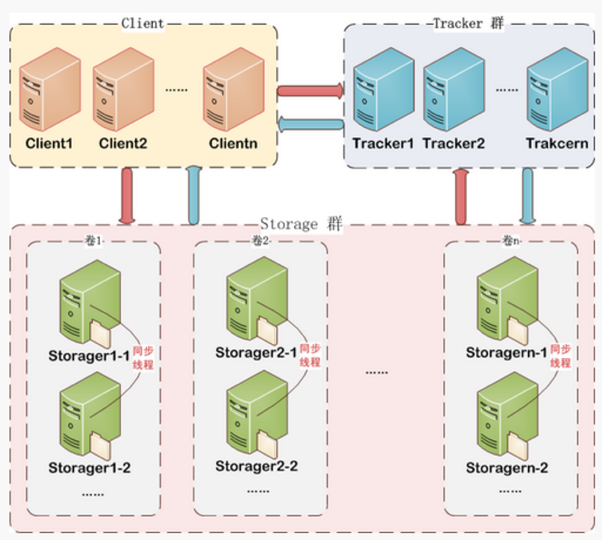
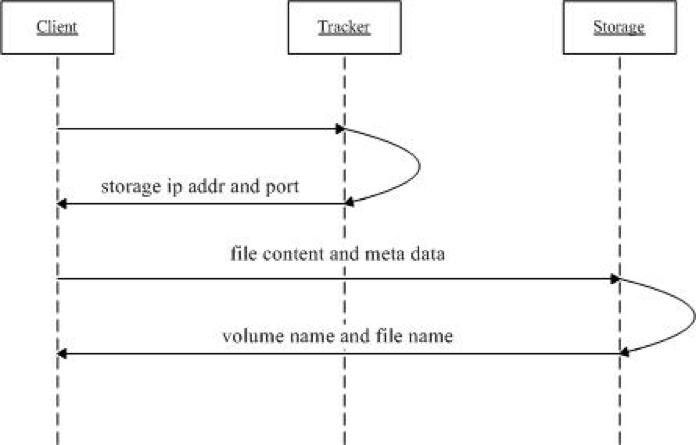
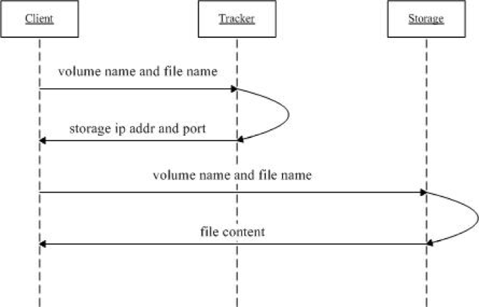

# FastDFS

## 架构原理

FastDFS总体架构由三个部分构成

- 客户端（Client）
- 访问服务器（TrackerServer）
- 存储服务器（StorageServer）



### 客户端（Client)

客户端指的是访问FastDFS分布式存储的客户端设备，通常是应用服务器。

### 访问服务器（TrackerServer）

TrackerServer是访问（或者翻译为跟踪）服务器，是Client访问StorageServer的入口。

TrackerServer起到几个作用:

- 【服务注册】管理StorageServer存储集群，StorageServer启动时，会把自己注册到TrackerServer上，并且定期报告自身状态信息，包括磁盘剩余空间、文件同步状况、文件上传下载次数等统计信息
- 【服务发现】Client访问StorageServer之前，必须先访问TrackerServer，动态获取到StorageServer的连接信息.

为了保证高可用，一个FastDFS集群当中可以有多个TrackerServer节点，由集群自动选举一个leader节点。

### 存储服务器（StorageServer）

StorageServer是数据存储服务器，文件和meta data都保存到存储服务器上。

- 可采用高可用的方式进行数据存储
- FastDFS集群当中StorageServer按组(Group/volume)提供服务，不同组的StorageServer之间不会相互通信，同组内的StorageServer之间会相互连接进行文件同步
- Storage server采用binlog文件记录文件上传、删除等更新操作。binlog中只记录文件名，不记录文件内容
- 文件同步只在同组内的Storage server之间进行，采用push方式，即源头服务器同步给目标服务器

### 文件存储

与大多数分布式文件系统类似，FastDFS可以将文件以及相关的描述信息(MetaData)保存到StorageServer当中。

文件存储以后将返回唯一的“文件标识”，“文件标识”由"组名"和"文件名"两部分构成

MetaData是文件的描述信息，如 width=1024,heigth=768

## 文件上传流程

文件上传的原理如下图所示



1. client询问tracker可以上传到哪一个storage,或者指定获取**某个组**的storage
2. tracker返回一台可用的storage
3. client直接和storage通讯完成文件上传
4. storage保存文件以后给client返回组名(volume)和文件名称

文件上传**服务端**内部处理的详细机制如下：

### 选择tracker

当集群中有多个tracker时，由于tracker之间是完全对等的关系，因此客户端在upload文件时可以任意选择一个trakcer

### 选择group

当客户端没有指定group时，由服务端tracker自动指定。当tracker接收到upload file的请求时，会为该文件分配一个可以存储该文件的group，支持如下选择group的规则：

1. Round robin，所有的group间轮询
2. Specified group，指定某一个确定的group
3. Load balance，剩余存储空间多多group优先

### 选择storage

当选定group后，tracker会在group内选择一个storage节点给客户端，支持如下选择storage的规则：

1. Round robin，在group内的所有storage间轮询
2. First server ordered by ip，按ip排序
3. First server ordered by priority，按优先级排序（优先级在storage上配置）

### 选择storage path

当分配好storage server后，客户端将向storage发送写文件请求，storage将会为文件分配一个数据存储目录，支持如下规则：

1. Round robin，多个存储目录间轮询
2. 剩余存储空间最多的优先

### 生成Fileid

选定存储目录之后，storage会为文件生一个Fileid:

1. storage server ip（32位整数）
2. 文件创建时间（unix时间戳，32位整数）
3. 文件大小
4. 文件crc32校验码
5. 随机数（这个字段用来避免文件重名）

Fileid由上述部分拼接而成，然后将这个二进制串进行base64编码，转换为可打印的字符串

### 选择文件子目录

当选定存储目录之后，storage会为文件分配一个fileid，每个存储目录下有两级256*256的子目录，storage会按文件fileid进行两次hash，路由到其中一个子目录，然后将文件以fileid为文件名存储到该子目录下

### 生成文件名返回客户端

当文件存储到某个子目录后，即认为该文件存储成功，接下来会为该文件生成一个文件名返回客户端，文件名由下述几个部分构成

1. group name-文件上传后所在的存储组名称
2. 存储目录 - 存储服务器配置的虚拟路径，与磁盘选项store_path*对应。如果配置了store_path0则是M00，如果配置了store_path1则是M01，以此类推
3. 数据两级目录 - 存储服务器在每个虚拟磁盘路径下创建的两级目录，用于存储数据文件
4. fileid
5. 文件后缀名（由客户端指定，主要用于区分文件类型）拼接而成

生成的文件名需返回到客户端，需要由客户端进行保存。

## 文件下载原理

文件下载的原理如下图所示



1. client询问tracker下载文件的storage，参数为文件标识（组名和文件名）
2. tracker返回一台可用的storage
3. client直接和storage通讯完成文件下载

由于storage有多个存储节点，存储节点间的文件同步是在后台异步进行的，所以有可能出现在读的时候，文件还没有同步到某些storage server上，为了尽量避免访问到这样的storage，tracker按照如下规则选择group内可读的storage：

1. 该文件上传到的源storage - 由于源头的地址被编码在文件名中，只要源头storage存活，优先返回
2. 文件创建时间戳==storage被同步到的时间戳 且(当前时间-文件创建时间戳) > 文件同步最大时间（如5分钟) - 文件创建后，认为经过最大同步时间后，肯定已经同步到其他storage了
3. 文件创建时间戳 < storage被同步到的时间戳。 - 同步时间戳之前的文件确定已经同步了
4. (当前时间-文件创建时间戳) > 同步延迟阀值（如一天）。 - 经过同步延迟阈值时间，认为文件肯定已经同步了


# Docker安装
```shell
docker pull sileeliu/fastdfs
docker run -d --privileged=true --net=host --name=fastdfs -e IP=ubuntu1804.wsl -e WEB_PORT=8888 -v /mnt/d/fastdfs:/var/local/fdfs sileeliu/fastdfs
```